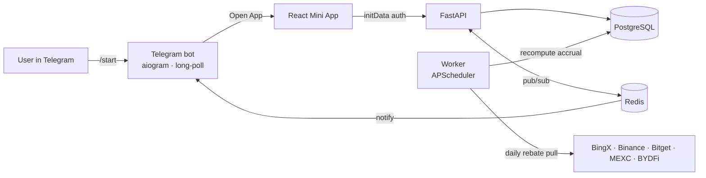

<div align="center">

<h1>Cashback Mini App</h1>

**A Telegram Mini App that pays traders back part of the fees they spend on crypto exchanges — full-stack, multi-exchange, with a live in-browser demo.**

**▶️ Live demo:** https://chigerartem.github.io/cashback-miniapp/

<sub>The hosted demo runs entirely client-side on mock data (no backend) — full stack details below.</sub>

[](https://chigerartem.github.io/cashback-miniapp/)
[](https://github.com/chigerartem/cashback-miniapp/actions/workflows/ci.yml)
[](https://www.python.org/)
[](https://fastapi.tiangolo.com/)
[](https://react.dev/)
[](https://www.typescriptlang.org/)
[](https://www.postgresql.org/)
[](https://github.com/astral-sh/ruff)
[](LICENSE)

**English** · [Русский](README.ru.md)

</div>

---

## What is this

**Cashback Mini App** is a Telegram Mini App for a crypto **fee rebate** service. A
user opens it from a Telegram bot, links an exchange account by its UID (or email),
and from then on automatically earns back a share of every trading fee they pay —
credited daily, with a referral program and VIP tiers, and withdrawable to USDT.

The exchange runs a broker/affiliate program: it pays the platform a cut of each
referred user's fees. The platform keeps a margin and returns the rest to the user
(and the referrer). The whole flow — linking, daily accrual, balances, withdrawals,
social-proof showcase — lives in this repo as a real full-stack app: a **React**
Mini App, a **FastAPI** backend, a background **worker**, and an **aiogram** bot,
wired together with **PostgreSQL** and **Redis**.

Five exchanges are integrated out of the box: **BingX, Binance, Bitget, MEXC, BYDFi**.
Each is optional — without API keys an exchange is still listed and connectable, but
accrual for it simply stays off.

## Demo

**▶️ https://chigerartem.github.io/cashback-miniapp/**

The hosted demo is the exact same React app built with `VITE_DEMO=true`: every API
call is served from an in-browser mock store ([`web/src/demo.ts`](web/src/demo.ts)),
so it needs no server and stays interactive — connect an exchange, run the savings
calculator, request a withdrawal. In production the app runs inside Telegram and talks
to the FastAPI backend instead.

## Features

- 💸 **Per-exchange cashback** — link BingX / Binance / Bitget / MEXC / BYDFi by UID (email for Binance); each verified against the real referral program before it's accepted.
- 🧮 **Savings calculator** — a log-scale calculator estimates daily/monthly cashback from volume, leverage, trade type and the selected exchange's real fee schedule.
- 🏆 **VIP tiers** — Bronze → VIP, each adding a bonus on top of the exchange base rate; progress is driven by lifetime paid-out.
- 👥 **Referrals** — a personal link; the inviter earns 15% of every invitee's cashback, for life.
- 🏦 **Withdrawals** — to TRC-20 or a BingX UID, with per-exchange balances, min/daily/monthly limits, a cooldown, and a row-locked balance check that can't be raced.
- 📈 **Live showcase** — global stats, a leaderboard and a recent-withdrawals feed, with a deterministic demo fallback so a fresh deploy never looks empty.
- 🔐 **Telegram-native auth** — every request is authenticated by validating Telegram Mini App `initData` (HMAC-SHA256) against the bot token; no passwords.
- 🛡️ **Anti-fraud** — a daily job flags wash-trading (abnormally low fee ratio) and shared-payout self-referrals, holding payouts for review.
- ⚙️ **Idempotent daily accrual** — a worker pulls each exchange's rebates and recomputes cashback per day under a Postgres advisory lock; re-running a day is safe.

## How it works



Each exchange pays the platform a broker commission (our share of the user's fee).
The worker pulls those commissions per day and the accrual engine splits each one:
the **user** gets `base_rate + VIP bonus` of their full fee, the **referrer** gets 15%
of the user's cashback, and the platform keeps the rest. The split is a pure,
unit-tested function — see [`cashback_math.py`](api/app/services/cashback_math.py).

## Tech stack

| Layer        | Choice                                                            |
| ------------ | ---------------------------------------------------------------- |
| Mini App     | React 18, Vite, TypeScript (strict), Tailwind CSS                 |
| Backend      | FastAPI, SQLAlchemy 2 (async), Alembic                           |
| Bot          | aiogram 3 (long polling)                                          |
| Worker       | APScheduler                                                       |
| Data         | PostgreSQL 16, Redis 7                                            |
| Exchange I/O | `httpx` (async clients for 5 exchanges)                          |
| Auth         | Telegram Mini App `initData` (HMAC-SHA256)                       |
| Deploy       | Docker Compose (api · worker · bot · web · postgres · redis)     |
| Quality      | pytest, ruff, GitHub Actions CI, Pages demo deploy               |

## Project structure

```
web/                     React Telegram Mini App (Vite)
  src/
    App.tsx              tab shell (Home · Calculator · Community · Profile)
    api.ts               typed API client (switches to demo when VITE_DEMO=true)
    demo.ts              in-browser mock store powering the live demo
    tabs/ · components/  UI
  default.conf.template  nginx config (CSP API origin injected via envsubst)
api/
  app/
    main.py              FastAPI app + routers
    auth.py              Telegram initData validation
    models.py            SQLAlchemy models
    routes/              me · exchanges · stats · referral · withdrawals
    services/            5 exchange clients · cashback engine · anti-fraud · demo data
    worker.py            APScheduler jobs (daily sync + accrual + anti-fraud)
    seed_demo.py         populate demo data + run the accrual engine
  alembic/               migrations
  tests/                 pytest (cashback math)
bot/                     standalone aiogram bot (/start, referral capture, notifications)
docker-compose.yml       full stack
```

## Quick start

### 1. Just look — the live demo

Open **https://chigerartem.github.io/cashback-miniapp/**. No setup.

### 2. Run the full stack (Docker)

Requires Docker.

```bash
git clone https://github.com/chigerartem/cashback-miniapp.git
cd cashback-miniapp
cp .env.example .env        # works as-is; fill in keys/token to go further
docker compose up -d --build
```

- API → http://localhost:8000 (`/health`, `/api/...`); migrations run on startup.
- Mini App (built) → http://localhost:8080.

Populate demo data so the showcase shows real figures (optional):

```bash
docker compose exec api python -m app.seed_demo
```

> A Telegram Mini App must be served over HTTPS to open inside Telegram. For real
> end-to-end testing, expose `web` through a tunnel (e.g. cloudflared / ngrok), set
> that domain as the bot's Mini App URL via [@BotFather](https://t.me/BotFather), and
> set `TG_BOT_TOKEN` + `WEB_DOMAIN`. For just exploring the UI, use the live demo.

### 3. Local dev

```bash
# Frontend (talks to a local API)
cd web && npm install && VITE_API_BASE=http://localhost:8000 npm run dev

# Backend (needs Postgres + Redis, e.g. from docker compose)
cd api && pip install -r requirements-dev.txt && alembic upgrade head
uvicorn app.main:app --reload
```

### 4. Build the static demo yourself

```bash
cd web && VITE_DEMO=true npm run build:demo   # → web/dist, fully client-side
```

## Configuration

Everything is read from environment variables ([`.env.example`](.env.example) documents
every option). The essentials:

| Variable                     | Required | Description                                           |
| ---------------------------- | :------: | ----------------------------------------------------- |
| `DATABASE_URL` / `REDIS_URL` |    ✅    | Connections (compose sets sane defaults)              |
| `TG_BOT_TOKEN`               |    ⚪    | Bot token from @BotFather — needed for real auth/bot  |
| `TG_BOT_USERNAME`            |    ⚪    | Bot username, used to build referral links            |
| `WEB_DOMAIN`                 |    ⚪    | Public domain the Mini App is served from (CORS)      |
| `VITE_API_BASE`              |    ⚪    | API origin baked into the frontend at build time      |
| `<EXCHANGE>_API_KEY/SECRET`  |    ⚪    | Per-exchange broker keys; without them accrual is off |
| `<EXCHANGE>_REBATE_RATE`     |    ⚪    | Our fee share, used to reconstruct the user's fee     |
| `DEMO_SOCIAL_PROOF`          |    ⚪    | `true` → demo fallback for showcase endpoints         |

## Cashback economics

For a broker commission `C` received on a user's trade, with the exchange's base rate
`b` (e.g. BingX 30%, Binance 5%), VIP bonus `v`, and our share of the fee `r`:

```
user_fee      = C / r
user_cashback = user_fee × (b + v)
referral      = user_cashback × 15%        (if the user was invited)
platform       = C − user_cashback − referral
```

Value is conserved (`user + referral + platform == C`), the split is computed in pure
Decimal, and the loss-leader case (where our rebate is smaller than the payout) is
handled explicitly. All of this is covered by [the tests](api/tests/test_cashback_split.py).

## Tests & CI

```bash
cd api && pytest -q          # cashback math
cd api && ruff check app tests
cd web && npm run typecheck && npm run build
```

GitHub Actions runs the API checks (ruff + pytest) and the web checks
(typecheck + build) on every push, and deploys the demo to Pages from `main`.

## License

MIT — see [LICENSE](LICENSE).
