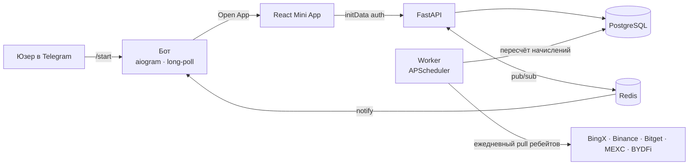

<div align="center">

<h1>Cashback Mini App</h1>

**Telegram Mini App, который возвращает трейдерам часть комиссий за торговлю на криптобиржах — full-stack, мультибиржевой, с живым демо прямо в браузере.**

**▶️ Живое демо:** https://chigerartem.github.io/cashback-miniapp/

<sub>Демо работает полностью на клиенте на мок-данных (без сервера) — детали стека ниже.</sub>

[](https://chigerartem.github.io/cashback-miniapp/)
[](https://github.com/chigerartem/cashback-miniapp/actions/workflows/ci.yml)
[](https://www.python.org/)
[](https://fastapi.tiangolo.com/)
[](https://react.dev/)
[](https://www.typescriptlang.org/)
[](https://www.postgresql.org/)
[](https://github.com/astral-sh/ruff)
[](LICENSE)

[English](README.md) · **Русский**

</div>

---

## Что это

**Cashback Mini App** — это Telegram Mini App для сервиса возврата комиссий (fee
rebate) с криптобирж. Пользователь открывает приложение из Telegram-бота, привязывает
аккаунт биржи по UID (или email) и с этого момента автоматически получает обратно
часть каждой торговой комиссии — начисление ежедневное, с реферальной программой и
VIP-уровнями, вывод в USDT.

Биржа ведёт брокерскую/партнёрскую программу: она отдаёт платформе долю комиссий
приведённого пользователя. Платформа оставляет себе маржу и возвращает остальное
пользователю (и пригласившему). Весь поток — привязка, ежедневное начисление, балансы,
выводы, витрина социального доказательства — это реальное full-stack-приложение:
Mini App на **React**, бэкенд на **FastAPI**, фоновый **worker** и бот на **aiogram**,
связанные через **PostgreSQL** и **Redis**.

Из коробки интегрированы пять бирж: **BingX, Binance, Bitget, MEXC, BYDFi**. Каждая
опциональна — без API-ключей биржа всё равно отображается и подключается, просто
начисление по ней не идёт.

## Демо

**▶️ https://chigerartem.github.io/cashback-miniapp/**

Это то же самое React-приложение, собранное с `VITE_DEMO=true`: каждый запрос к API
обслуживается мок-хранилищем в браузере ([`web/src/demo.ts`](web/src/demo.ts)), поэтому
сервер не нужен, а приложение остаётся интерактивным — подключите биржу, посчитайте
экономию в калькуляторе, оформите вывод. В проде приложение работает внутри Telegram и
обращается к бэкенду на FastAPI.

## Возможности

- 💸 **Кешбэк по каждой бирже** — привязка BingX / Binance / Bitget / MEXC / BYDFi по UID (Binance — по email); каждый UID проверяется в реальной партнёрской программе перед привязкой.
- 🧮 **Калькулятор экономии** — логарифмическая шкала оценивает кешбэк в день/месяц по объёму, плечу, типу сделки и реальной сетке комиссий выбранной биржи.
- 🏆 **VIP-уровни** — Bronze → VIP, каждый добавляет бонус сверх базовой ставки биржи; прогресс по сумме выведенного за всё время.
- 👥 **Рефералы** — персональная ссылка; пригласивший получает 15% от кешбэка приглашённого, пожизненно.
- 🏦 **Выводы** — на TRC-20 или BingX UID, с балансами по биржам, лимитами (мин./день/месяц), кулдауном и проверкой баланса под row-lock (без гонок).
- 📈 **Живая витрина** — глобальная статистика, лидерборд и лента последних выплат, с детерминированным демо-фолбэком, чтобы свежий деплой не выглядел пустым.
- 🔐 **Нативная авторизация Telegram** — каждый запрос проверяется валидацией `initData` Telegram Mini App (HMAC-SHA256) по токену бота; без паролей.
- 🛡️ **Антифрод** — ежедневная джоба ловит wash-trading (аномально низкое отношение комиссии к объёму) и self-referral на один адрес выплаты, ставя выводы на холд.
- ⚙️ **Идемпотентное начисление** — worker тянет ребейты каждой биржи и пересчитывает кешбэк за день под advisory-локом Postgres; повторный прогон за дату безопасен.

## Как это работает



Каждая биржа платит платформе брокерскую комиссию (нашу долю от комиссии юзера). Worker
тянет эти комиссии за день, а движок начисления делит каждую: **юзер** получает
`базовая ставка + VIP-бонус` от своей полной комиссии, **реферер** — 15% от кешбэка
юзера, остальное остаётся платформе. Сплит — чистая, покрытая тестами функция, см.
[`cashback_math.py`](api/app/services/cashback_math.py).

## Стек

| Слой         | Выбор                                                            |
| ------------ | --------------------------------------------------------------- |
| Mini App     | React 18, Vite, TypeScript (strict), Tailwind CSS                |
| Бэкенд       | FastAPI, SQLAlchemy 2 (async), Alembic                          |
| Бот          | aiogram 3 (long polling)                                         |
| Worker       | APScheduler                                                      |
| Данные       | PostgreSQL 16, Redis 7                                           |
| Биржи        | `httpx` (async-клиенты к 5 биржам)                              |
| Авторизация  | Telegram Mini App `initData` (HMAC-SHA256)                      |
| Деплой       | Docker Compose (api · worker · bot · web · postgres · redis)    |
| Качество     | pytest, ruff, GitHub Actions CI, деплой демо на Pages           |

## Структура проекта

```
web/                     React Telegram Mini App (Vite)
  src/
    App.tsx              каркас вкладок (Главная · Калькулятор · Комьюнити · Профиль)
    api.ts               типизированный API-клиент (демо при VITE_DEMO=true)
    demo.ts              мок-хранилище в браузере для живого демо
    tabs/ · components/  UI
  default.conf.template  конфиг nginx (origin API в CSP подставляется через envsubst)
api/
  app/
    main.py              FastAPI-приложение + роутеры
    auth.py              валидация Telegram initData
    models.py            модели SQLAlchemy
    routes/              me · exchanges · stats · referral · withdrawals
    services/            5 клиентов бирж · движок кешбэка · антифрод · демо-данные
    worker.py            джобы APScheduler (синк + начисление + антифрод)
    seed_demo.py         наполнение демо-данными + прогон движка начисления
  alembic/               миграции
  tests/                 pytest (математика кешбэка)
bot/                     отдельный aiogram-бот (/start, захват реферала, уведомления)
docker-compose.yml       весь стек
```

## Быстрый старт

### 1. Просто посмотреть — живое демо

Откройте **https://chigerartem.github.io/cashback-miniapp/**. Без настройки.

### 2. Запустить весь стек (Docker)

Нужен Docker.

```bash
git clone https://github.com/chigerartem/cashback-miniapp.git
cd cashback-miniapp
cp .env.example .env        # работает как есть; ключи/токен — по желанию
docker compose up -d --build
```

- API → http://localhost:8000 (`/health`, `/api/...`); миграции применяются на старте.
- Mini App (собранный) → http://localhost:8080.

Наполнить демо-данными, чтобы витрина показывала реальные цифры (опционально):

```bash
docker compose exec api python -m app.seed_demo
```

> Telegram Mini App открывается внутри Telegram только по HTTPS. Для реального
> end-to-end теста проксируйте `web` через туннель (cloudflared / ngrok), укажите этот
> домен как Mini App URL бота в [@BotFather](https://t.me/BotFather) и задайте
> `TG_BOT_TOKEN` + `WEB_DOMAIN`. Чтобы просто посмотреть UI — используйте живое демо.

### 3. Локальная разработка

```bash
# Фронтенд (обращается к локальному API)
cd web && npm install && VITE_API_BASE=http://localhost:8000 npm run dev

# Бэкенд (нужны Postgres + Redis, например из docker compose)
cd api && pip install -r requirements-dev.txt && alembic upgrade head
uvicorn app.main:app --reload
```

### 4. Собрать статическое демо самому

```bash
cd web && VITE_DEMO=true npm run build:demo   # → web/dist, полностью на клиенте
```

## Конфигурация

Всё читается из переменных окружения (все опции описаны в [`.env.example`](.env.example)).
Главное:

| Переменная                   | Обяз. | Описание                                                |
| ---------------------------- | :---: | ------------------------------------------------------- |
| `DATABASE_URL` / `REDIS_URL` |  ✅   | Подключения (в compose есть разумные дефолты)           |
| `TG_BOT_TOKEN`               |  ⚪   | Токен бота от @BotFather — нужен для реальной авторизации |
| `TG_BOT_USERNAME`            |  ⚪   | Username бота, для построения реферальных ссылок         |
| `WEB_DOMAIN`                 |  ⚪   | Публичный домен Mini App (CORS)                         |
| `VITE_API_BASE`              |  ⚪   | Origin API, вшивается во фронт при сборке               |
| `<EXCHANGE>_API_KEY/SECRET`  |  ⚪   | Брокерские ключи биржи; без них начисление выключено    |
| `<EXCHANGE>_REBATE_RATE`     |  ⚪   | Наша доля комиссии, чтобы восстановить fee юзера         |
| `DEMO_SOCIAL_PROOF`          |  ⚪   | `true` → демо-фолбэк для витринных эндпоинтов            |

## Экономика кешбэка

Для брокерской комиссии `C`, полученной со сделки юзера, при базовой ставке биржи `b`
(например BingX 30%, Binance 5%), VIP-бонусе `v` и нашей доле комиссии `r`:

```
комиссия_юзера = C / r
кешбэк_юзеру    = комиссия_юзера × (b + v)
реферальные     = кешбэк_юзеру × 15%        (если юзера пригласили)
платформе       = C − кешбэк_юзеру − реферальные
```

Сумма сохраняется (`юзер + реферал + платформа == C`), сплит считается в чистом
Decimal, а случай loss-leader (когда наш ребейт меньше выплаты) обработан явно. Всё это
покрыто [тестами](api/tests/test_cashback_split.py).

## Тесты и CI

```bash
cd api && pytest -q          # математика кешбэка
cd api && ruff check app tests
cd web && npm run typecheck && npm run build
```

GitHub Actions на каждый push прогоняет проверки API (ruff + pytest) и веба
(typecheck + build) и деплоит демо на Pages из ветки `main`.

## Лицензия

MIT — см. [LICENSE](LICENSE).
